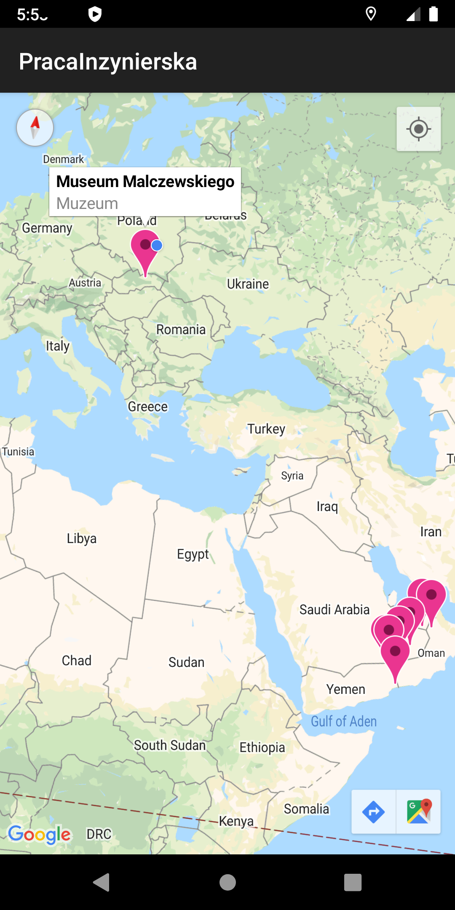

<H1>RadomPlacesApp </H1> 
Project of tour app about my hometown Radom. Project written in Java programming language. In that project i worked with Google Maps APi, i use static maps with marker
to show places location on map. I also tried wrote app with current standards, so i use Jetpack library, for example Room comonent. 
<H2>Sample views from my app</H2>  

